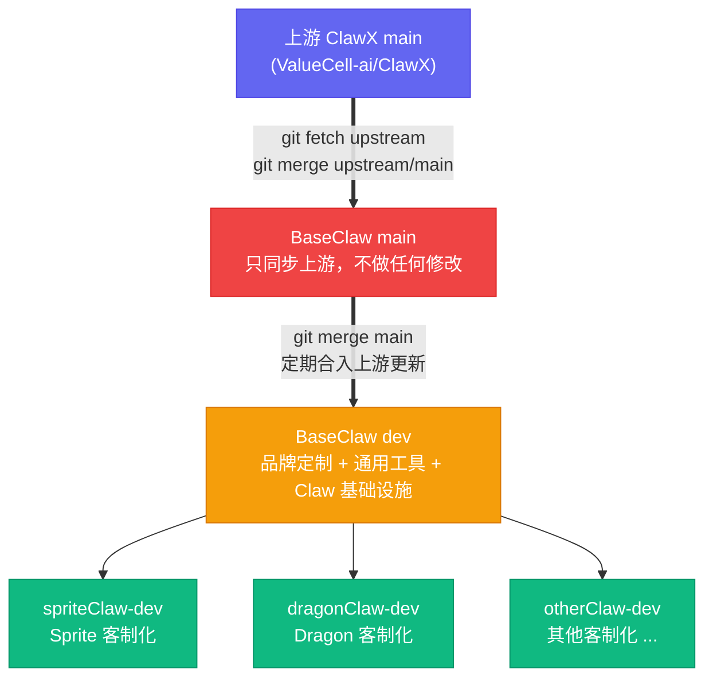
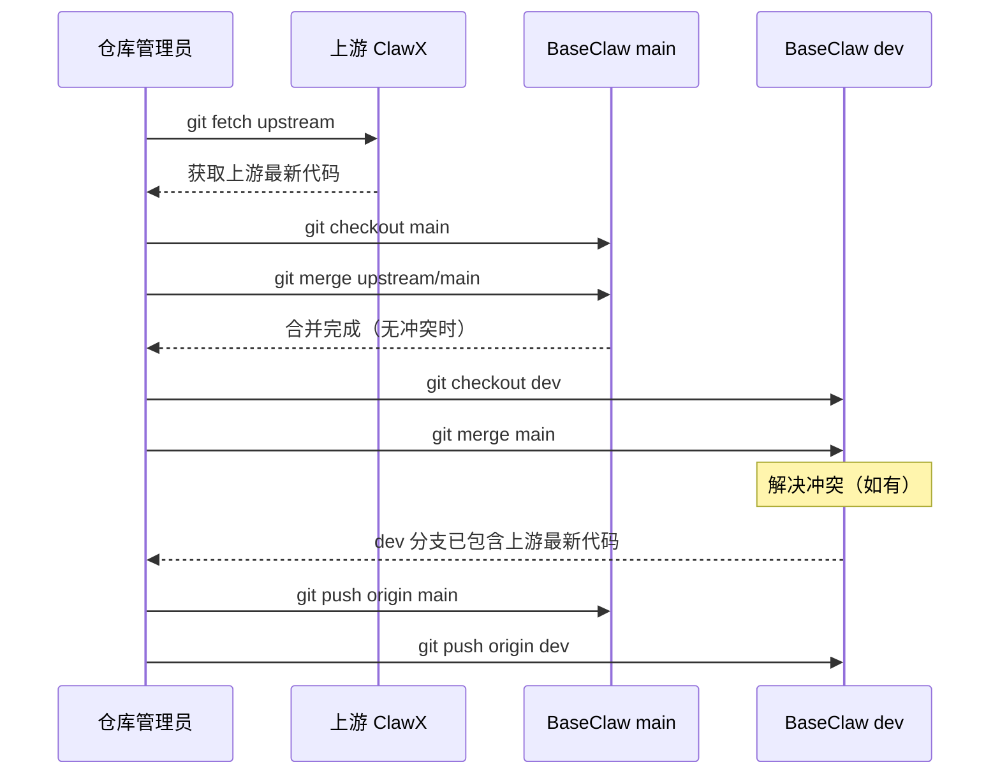
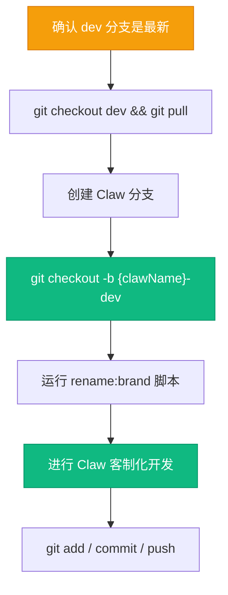
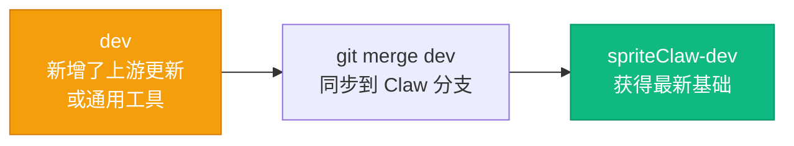
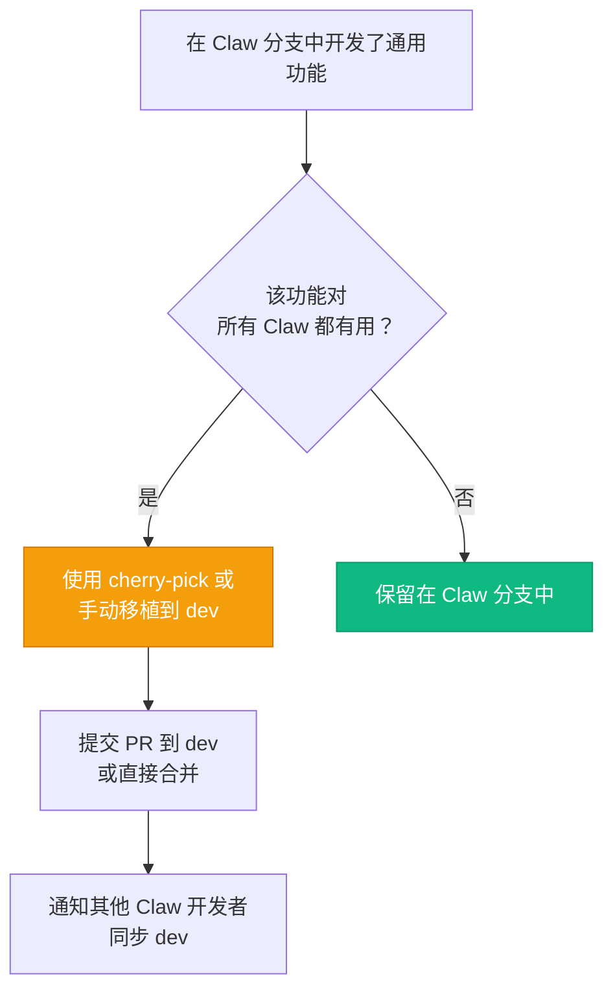
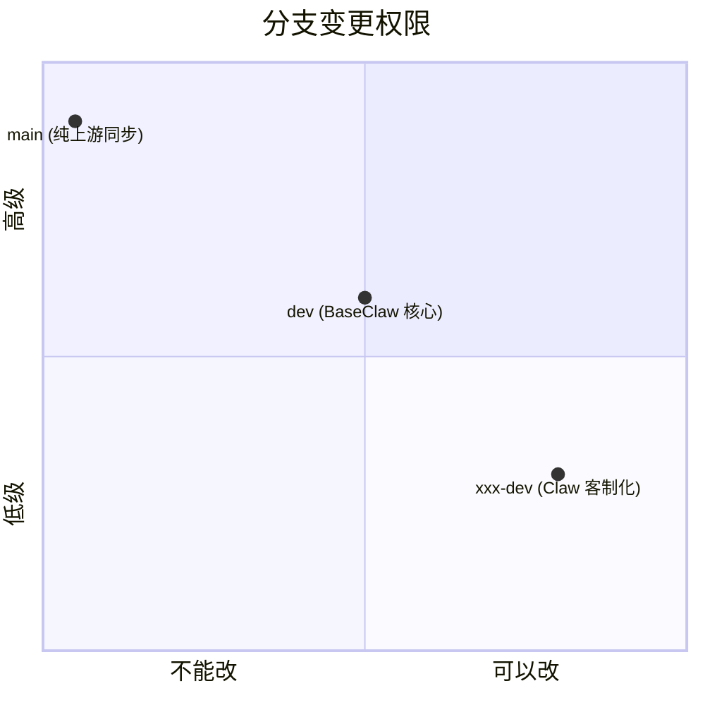
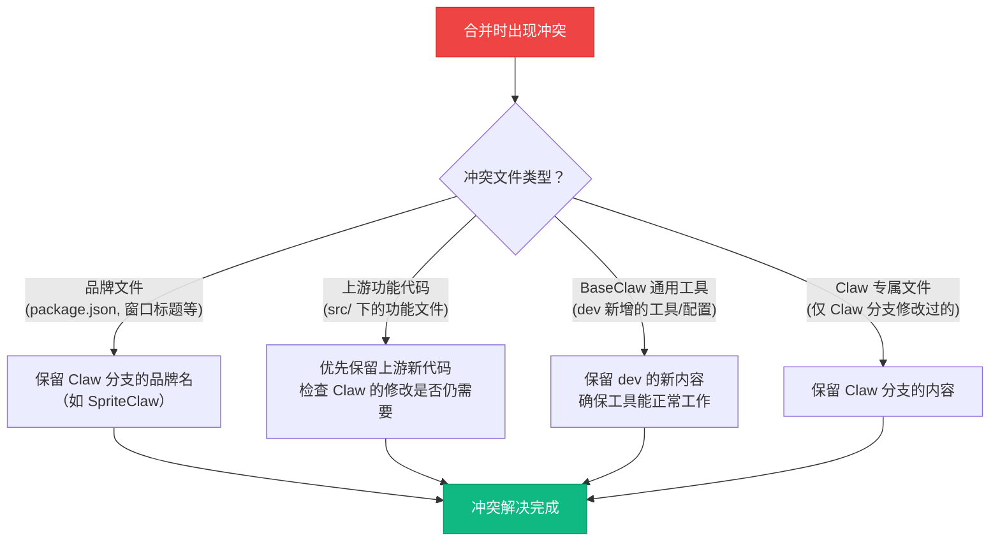
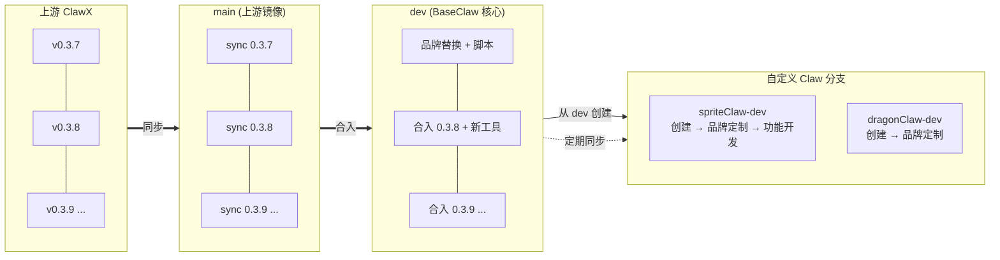
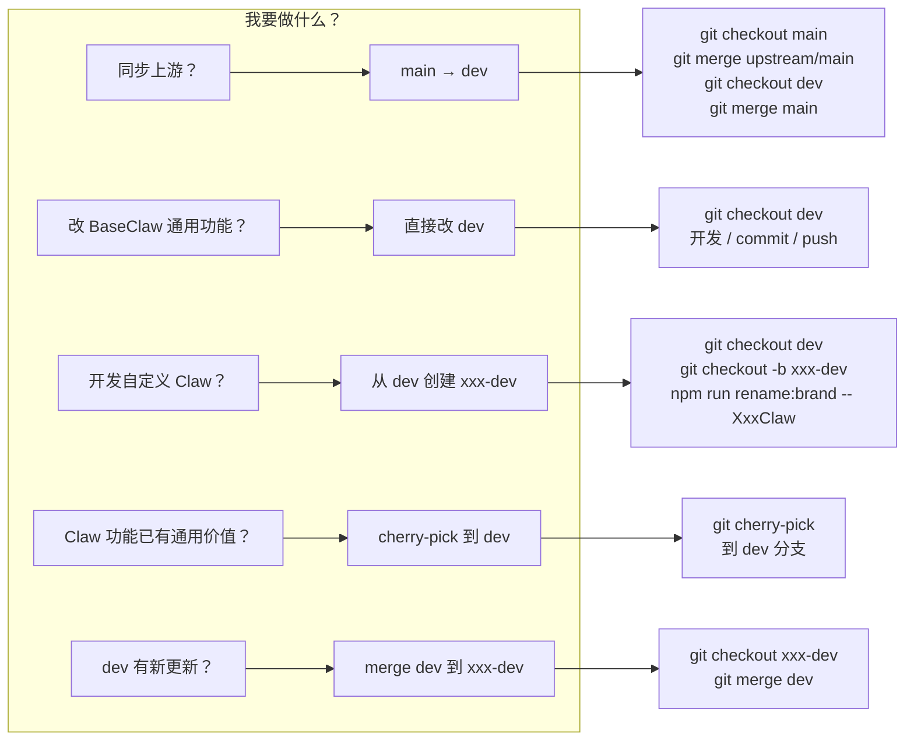

# BaseClaw 分支策略与工作流

## 概述

BaseClaw 是 ClawX 的 Fork 仓库。为了同时保持与上游仓库的同步能力，又能独立进行品牌定制和功能扩展，我们采用 **三层分支模型**：

```
上游 ClawX (main)
    │
    ▼
BaseClaw main ──── 只做一件事：同步上游代码，不做任何修改
    │
    ▼
BaseClaw dev ──── BaseClaw 核心：品牌定制 + 通用工具 + Claw 定制基础设施
    │
    ▼
{xxx}-dev ──── 每位开发者的自定义 Claw 分支（如 spriteClaw-dev）
```

---

## 一、分支全景图



---

## 二、各分支职责

### 2.1 `main` 分支 — 上游镜像

| 属性 | 说明 |
|------|------|
| 用途 | 永远保持与上游 ClawX `main` 分支的代码一致 |
| 谁可以提交 | 仅仓库管理员 |
| 允许的操作 | `git merge upstream/main` |
| 禁止的操作 | 任何手动代码修改、直接 push commit |
| 保护规则 | 建议开启 branch protection，禁止 force push |

**核心原则：`main` 分支是只读的上游镜像，它存在的唯一价值是让我们随时能拿到上游的最新代码。**

---

### 2.2 `dev` 分支 — BaseClaw 核心

| 属性 | 说明 |
|------|------|
| 用途 | BaseClaw 对上游代码的定制修改 + 提供给所有 Claw 的通用工具和基础设施 |
| 谁可以提交 | BaseClaw 核心开发团队 |
| 基于分支 | 定期从 `main` 合入上游更新 |
| 允许的操作 | 品牌定制、通用工具开发、Claw 定制基础设施 |

`dev` 分支承载的内容包括但不限于：

- **品牌定制**：将 ClawX 的品牌替换为 BaseClaw
- **`rename:brand` 脚本**：帮助开发者快速重品牌的自动化工具
- **预置 Skills 和 Agents**：为所有自定义 Claw 提供的通用 AI 能力
- **Claw 定制基础设施**：让开发者能方便地创建和管理自己 Claw 的工具、脚本和配置
- **通用 Bug Fix**：修复上游未修复但所有 Claw 都会受益的问题

**核心原则：`dev` 分支的代码变更对所有 Claw 分支通用，不应包含任何单个 Claw 的专属修改。**

---

### 2.3 `{xxx}-dev` 分支 — 自定义 Claw 开发分支

| 属性 | 说明 |
|------|------|
| 用途 | 单个 Claw 的客制化开发 |
| 命名规范 | `{clawName}-dev`，如 `spriteClaw-dev`、`dragonClaw-dev` |
| 基于分支 | 始终从最新的 `dev` 分支创建 |
| 谁可以提交 | 该 Claw 的负责人 / 开发团队 |
| 允许的操作 | 该 Claw 特有的功能、UI、配置、品牌等所有客制化内容 |

**核心原则：自定义 Claw 分支是隔离的，Claw 特有的代码只存在于自己的分支，不应回流到 `dev`。**

---

## 三、工作流程

### 3.1 同步上游代码到 `main`



**操作步骤：**

```bash
# 1. 添加上游仓库（仅需首次）
git remote add upstream https://github.com/ValueCell-ai/ClawX.git

# 2. 拉取上游最新代码
git fetch upstream

# 3. 更新 main 分支
git checkout main
git merge upstream/main

# 4. 更新 dev 分支
git checkout dev
git merge main
# 如有冲突，手动解决后：
# git add .
# git commit

# 5. 推送
git push origin main
git push origin dev
```

---

### 3.2 创建自定义 Claw 开发分支



**操作步骤：**

```bash
# 1. 确保在最新的 dev 分支上
git checkout dev
git pull origin dev

# 2. 创建你的 Claw 开发分支（以 SpriteClaw 为例）
git checkout -b spriteClaw-dev

# 3. 运行品牌重命名脚本
npm run rename:brand -- SpriteClaw

# 4. 开始客制化开发...
# 修改 UI、添加功能、配置 Agent 等

# 5. 推送到远程
git push -u origin spriteClaw-dev
```

---

### 3.3 将 `dev` 的更新同步到 Claw 分支

当 `dev` 分支合入了上游新代码或添加了新的通用工具时，各 Claw 分支需要同步这些更新。



**操作步骤：**

```bash
# 1. 切换到你的 Claw 分支
git checkout spriteClaw-dev
git pull origin spriteClaw-dev

# 2. 合入 dev 的最新更新
git merge dev

# 3. 解决冲突（如有）
# 冲突通常发生在 dev 修改了和 Claw 分支相同的文件
# 原则：保留 Claw 分支的客制化内容，合入 dev 的新功能/修复

# 4. 推送
git push origin spriteClaw-dev
```

---

### 3.4 通用功能贡献回 `dev`

如果你在自己的 Claw 分支中开发了一个功能，认为它对所有 Claw 都有用，应该贡献回 `dev`。



> **重要**：使用 `git cherry-pick` 将单个 commit 移植到 `dev`，而不是将整个 Claw 分支合并回 `dev`，以避免将 Claw 特有的代码带入 `dev`。

---

## 四、分支变更权限矩阵



| 操作 | `main` | `dev` | `xxx-dev` |
|------|--------|-------|-----------|
| 合并上游代码 | ✅ 仅管理员 | ❌ | ❌ |
| 品牌定制 (BaseClaw) | ❌ | ✅ | ❌ |
| 通用工具/基础设施 | ❌ | ✅ | ❌ |
| Claw 专属功能/品牌 | ❌ | ❌ | ✅ |
| 从 `main` 拉取更新 | N/A | ✅ | ❌ |
| 从 `dev` 拉取更新 | N/A | N/A | ✅ |
| 直接 push commit | ❌ | ✅ 团队 | ✅ 负责人 |
| Force push | ❌ | ❌ | ⚠️ 仅必要时 |

---

## 五、冲突处理策略

当从 `dev` 或 `main` 合入更新到 Claw 分支时，可能产生冲突。



---

## 六、完整生命周期示意



---

## 七、命名规范

| 类型 | 格式 | 示例 |
|------|------|------|
| 自定义 Claw 分支 | `{clawName}-dev` | `spriteClaw-dev` |
| Claw 的功能分支 | `{clawName}-dev-{feature}` | `spriteClaw-dev-chat-ui` |
| Claw 的热修复 | `{clawName}-dev-hotfix-{desc}` | `spriteClaw-dev-hotfix-login` |
| dev 的功能分支 | `dev-{feature}` | `dev-rename-tool` |

---

## 八、快速参考卡


